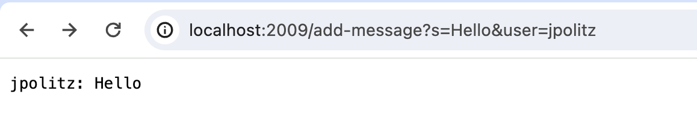
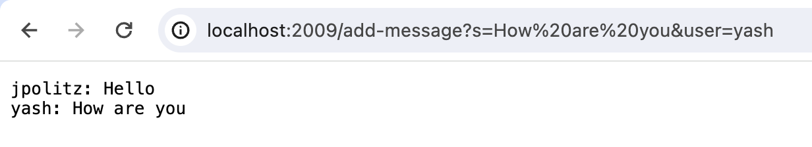
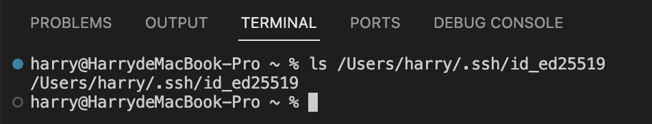
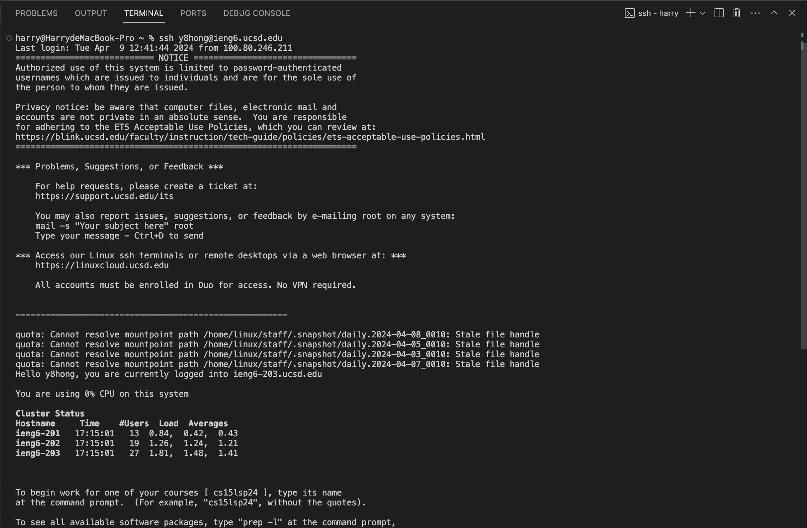

# Lab Report 2

## Part 1: Servers

ChatServer Code
--------------------------
>
    import java.io.IOException;
    import java.net.URI;
    
    class Handler implements URLHandler {
    
        String messages = "";
        public String handleRequest(URI url) {
            if (url.getPath().equals("/")) {
                return messages;
            }
            else if (url.getPath().equals("/add-message")) {
                String query = url.getQuery();
                String[] params = query.split("&");
                String user = "";
                String message = "";
    
                for (String para: params) {
                    String[] input = para.split("=");
                    if (input[0].equals("s")) {
                        message = input[1];
                    }
                    else if (input[0].equals("user")) {
                        user = input[1];
                    }
                }
    
                if (!user.isEmpty() && !message.isEmpty()) {
                    messages += user + ": " + message + "\n";
                }
                return messages;
            }
            else {
                return "404 Not Found!";
            }
        }
    }
    
    
    class ChatServer {
        public static void main(String[] args) throws IOException{
            if(args.length == 0) {
                System.out.println("Missing port number! Try any number between 1024 to 49151");
            }
            
            int portNum = Integer.parseInt(args[0]);
    
            Server.start(portNum, new Handler());
        }
    }

1. **Method Called:** `handleRequest(URI url)` method in `Handler` class was called.

2. **Relevant arguments and values of fields:**
   
   `url`: `/add-message?s=Hello&user=jpolitz`
   
   `user`: `"jpolitz"`
   
   `message`: `"Hello"`
   
   `messages`: `""`
   
3. **Changes in relevant fields:**
   The value of field `messages` updates to `"jpolitz: Hello\n"`.

1. **Method Called:** `handleRequest(URI url)` method in `Handler` class was called.

2. **Relevant arguments and values of fields:**
   
   `url`: `/add-message?s=How are you&user=yash`
   
   `user`: `"yash"`
   
   `message`: `"How are you"`
   
   `messages`: `"jpolitz: Hello\n"`
   
3. **Changes in relevant fields:**
   The value of field `messages` updates to

   `"jpolitz: Hello\n"`
   
   `"yash: How are you\n"`.

## Part 2 
1. 

2. 

3. 
